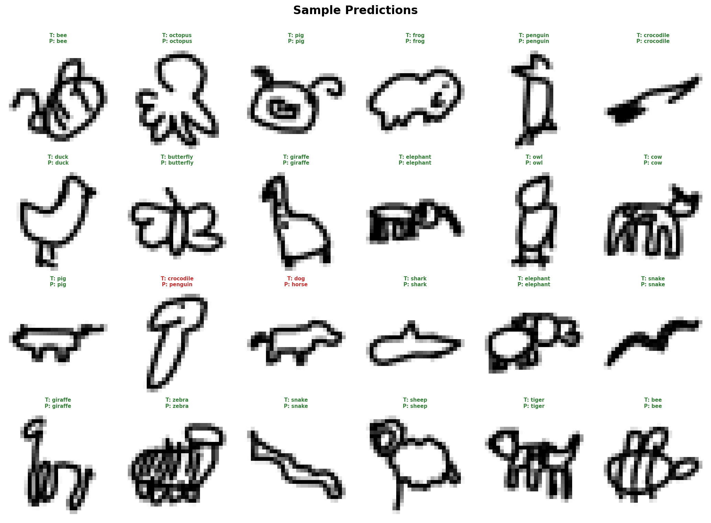

# Animal Doodle Guesser

A machine learning web app that recognises hand-drawn animal sketches in real time using a Convolutional Neural Network (CNN) trained on Google's Quick Draw dataset.

Draw an animal on the canvas and the model will guess what it is — live, in your browser.

---

## Demo



---

## Animals (28 categories)

`cat` `dog` `elephant` `giraffe` `shark` `octopus` `butterfly` `owl` `penguin` `mouse` `snake` `frog` `lion` `horse` `rabbit` `pig` `duck` `whale` `monkey` `cow` `crocodile` `dolphin` `sheep` `bee` `sea turtle` `camel` `snail` `crab`

---

## Project Structure

```
quickdraw_classifier/
├── download_data.py      # Downloads and loads Quick Draw data
├── model_train.py        # Builds and trains the CNN
├── evaluate.py           # Generates evaluation plots
├── demo.py               # Streamlit live drawing demo
├── data/                 # Downloaded .npy files (not included — see below)
├── model/                # Saved model and categories (not included — see below)
└── plots/                # Generated evaluation plots
```

---

## Getting Started

### 1. Clone the repository

```bash
git clone https://github.com/YOUR_USERNAME/quickdraw_classifier.git
cd quickdraw_classifier
```

### 2. Install dependencies

```bash
pip install -r requirements.txt
```

> Requires Python 3.10 or 3.11. TensorFlow does not fully support Python 3.13 on Windows — if you encounter issues, use Python 3.11.

### 3. Download the dataset

The dataset is sourced automatically from [Google's Quick Draw dataset](https://quickdraw.withgoogle.com/data) — no manual download needed.

```bash
python download_data.py
```

This will create a `data/` folder and download a `.npy` file for each of the 28 animal categories (10,000 samples each, ~280,000 total sketches). Files already downloaded are skipped automatically.

> **Optional:** A pre-downloaded copy of the dataset is available on Google Drive:
> 🔗 [Quick Draw Dataset — data/ folder](YOUR_GOOGLE_DRIVE_LINK_HERE)
>
> Download and place the contents inside a `data/` folder in the project root.

### 4. Train the model

```bash
python model_train.py
```

This trains a CNN with data augmentation for up to 20 epochs (early stopping included). Training takes approximately **1.5–2 hours on CPU**.

The trained model is saved to `model/quickdraw_model.keras`.

> **Optional:** A pre-trained model is available on Google Drive:
> 🔗 [Pre-trained model — model/ folder](YOUR_GOOGLE_DRIVE_LINK_HERE)
>
> Download and place the contents inside a `model/` folder in the project root. This lets you skip straight to the demo without retraining.

### 5. Evaluate the model

```bash
python evaluate.py
```

Generates 3 plots saved to `plots/`:
- `confusion_matrix.png` — heatmap of per-class predictions
- `per_class_accuracy.png` — bar chart of accuracy per category
- `sample_predictions.png` — grid of 24 sample predictions

### 6. Run the demo

```bash
streamlit run demo.py
```

Opens the live drawing app in your browser at `http://localhost:8501`. Draw an animal and the model predicts it in real time.

---

## Model Architecture

A 3-block CNN built with TensorFlow/Keras:

```
Input (28×28×1)
  → RandomRotation + RandomTranslation + RandomZoom   (data augmentation)
  → Conv2D(32) → BatchNorm → MaxPool → Dropout(0.25)  (block 1)
  → Conv2D(64) → BatchNorm → MaxPool → Dropout(0.25)  (block 2)
  → Conv2D(128) → BatchNorm → Dropout(0.25)           (block 3)
  → Flatten → Dense(256) → Dropout(0.5)
  → Dense(28, softmax)                                 (output)
```

**Total parameters:** ~1.7M

### Regularization techniques used
- **Dropout** — prevents overfitting by randomly disabling neurons during training
- **Batch Normalization** — stabilizes training and acts as a mild regularizer
- **Data Augmentation** — random rotation, translation and zoom to improve generalisation to real drawings

---

## Results

| Metric | Value |
|---|---|
| Test Accuracy | ~73% |
| Categories | 28 |
| Training samples | 280,000 (10k per category) |
| Epochs trained | ~16 (early stopping) |

---

## Dataset

Trained on [Google Quick Draw](https://quickdraw.withgoogle.com/data) — a collection of 50 million hand-drawn sketches across 345 categories, collected from players of the Quick Draw game.

Data is available as 28×28 grayscale numpy bitmaps via:
```
https://storage.googleapis.com/quickdraw_dataset/full/numpy_bitmap/{category}.npy
```

---

## Dependencies

| Package | Purpose |
|---|---|
| `tensorflow` | CNN model training and inference |
| `numpy` | Data loading and processing |
| `scikit-learn` | Train/test splitting, evaluation metrics |
| `matplotlib` / `seaborn` | Evaluation plots |
| `streamlit` | Web app interface |
| `streamlit-drawable-canvas` | Drawing canvas widget |
| `pillow` | Image preprocessing |

---

## Notes

- Drawing style matters — the model was trained on quick, minimal sketches. Simple outlines work better than detailed realistic drawings.
- Some animals are harder than others at 28×28 resolution (e.g. cow vs horse look very similar).
- The model runs on CPU — no GPU required.